## Bem-vindo(a) ao perfil do israel monteiro 😁

 

   <a href="https://github.com/israel-monteiro">
   
   

    

 
  
  
  

 
 
 
### Pra conteúdo sobre programação me segue a gente nas redes abaixo!
 

 
  
  

<picture align="center">
  <source media="(prefers-color-scheme: dark)" srcset="https://raw.githubusercontent.com/mari4souza/mari4souza/output/github-contribution-grid-snake-dark.svg">
  <source media="(prefers-color-scheme: light)" srcset="https://raw.githubusercontent.com/mari4souza/mari4souza/output/github-contribution-grid-snake-dark.svg">
  
</picture>
